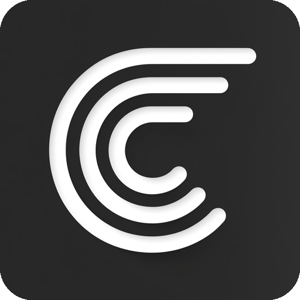

<div align="center">



# Base GPUI

**A GPUI-native port of Base UI's rich, headless component APIs.**

[](LICENSE)

</div>

Base GPUI ports [Base UI](https://base-ui.com/)'s rich component API surface to GPUI: compound parts, controlled and uncontrolled state, keyboard interaction, state-aware styling, and accessibility semantics. Components are unstyled, so applications retain complete control over their visual design.

The public API follows Base UI where its concepts map cleanly to native applications, while the implementation is designed specifically for GPUI's immediate-mode rendering model.

> [!IMPORTANT]
> Base GPUI is under active development. APIs may change before version 1.0. Install it from GitHub, as is common for projects using GPUI's actively developed Git revision.

## Installation

```toml
[dependencies]
base-gpui = { git = "https://github.com/LukeTandjung/base-gpui" }
gpui = { git = "https://github.com/zed-industries/zed", rev = "1d029c5ff5654fb1b1e8caf4462993c8ee13a133" }
```

## Usage

Initialize Base GPUI when your application starts:

```rust
use gpui::{App, Application};

fn main() {
    Application::new().run(|cx: &mut App| {
        base_gpui::init(cx);
        // Open your application window.
    });
}
```

Components expose compound parts and state-aware styling. For example, tabs are composed from `TabsRoot`, `TabsList`, `TabsTab`, `TabsIndicator`, and `TabsPanel` rather than a single pre-styled widget.

## Components

Base GPUI currently includes APIs for accordions, dialogs, buttons, checkboxes, comboboxes, menus, popovers, selects, sliders, tabs, toasts, tooltips, and other common interface patterns.

Browse the [component guides](docs/components/README.md) for each component's compound parts, behavioral builders, supporting types, style state, and accessibility model.

## Design

Base GPUI is a deliberate GPUI port of Base UI's public component concepts—not a Rust translation of Base UI's React internals. It preserves the expressive headless API while implementing behavior, state, rendering, and accessibility through GPUI-native mechanisms.

Accessibility semantics and keyboard behavior are built into components where GPUI exposes the required primitives. Known gaps caused by missing upstream GPUI accessibility APIs are documented rather than silently approximated.

See [the component architecture](docs/component-architecture.md) for details.

## Project relationships

Base GPUI is an independent community project. It is not affiliated with, endorsed by, or maintained by the Base UI or Zed teams.

- [Base UI](https://base-ui.com/) inspired the component API design.
- [GPUI](https://gpui.rs/) is the underlying application framework.

The Base UI and GPUI names and logos belong to their respective owners.

## License

[MIT](LICENSE)
